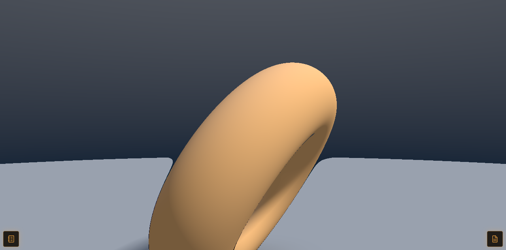

# turnip-kgsl-shim

**WebGPU running on a phone's real GPU, inside a terminal browser, with no root and no rebuilt Chromium.**

This is the load-bearing piece that gets `navigator.gpu` onto an Adreno 740 through a stack that
was never supposed to allow it: Android → Termux → a headless Linux Chromium → a graphics gallery
mirrored on a handheld's top screen. It turned out to be surprisingly hard — the GPU is reachable,
but at four different layers something quietly refuses to use it, and one of those refusals will
overheat the device if you brute-force it. This repo is the ~200-line Vulkan shim at the center of
the fix, plus the tools and the write-up for the rest.



> That frame is WGSL running on the Adreno, read back and blitted into a 2D canvas, screencast to
> a viewer — see [Results](#results). More detail and diagrams live in
> [`docs/HOW-IT-WORKS.md`](docs/HOW-IT-WORKS.md).

---

## The problem, in human terms

The device is an **AYN Thor**: a dual-screen Android handheld, Snapdragon 8 Gen 2, **Adreno 740**,
arm64. The bottom screen is a terminal, the top screen is a browser. All the tooling lives in
Termux (bionic, no root, ever), and the browser you watch is a **headless Termux Chromium** mirrored
full-screen through the [Thor Viewer](https://github.com/MaterDev/thor-viewer).

The goal was simple to state: make the WebGPU pieces in the [Canvas Lab](https://github.com/MaterDev/thor-canvas-lab)
gallery run on the actual GPU, visible in that mirror, without crashing anything. WebGL2 already
did — hardware-accelerated at 60fps via ANGLE-on-Vulkan. WebGPU did not. It either fell back to a
software rasterizer or, on one memorable configuration, **crash-looped the GPU process and
physically overheated the handheld**.

The reasons stack up:

- **This Adreno is KGSL-only.** The GPU is reached through `/dev/kgsl-3d0`. There is a
  `/dev/dri/renderD128` and a `card0`, but they are the *display controller* (`msm_drm`/`mdss`), not
  a render node for the GPU — there is **no DRM render node and no DRM master** for the Adreno. Only
  Termux's bionic Mesa Turnip is built with the KGSL backend; stock glibc Turnip (and the prebuilt
  glibc `dawn.node`) enumerate **zero GPUs** here. So the whole solution has to live in bionic, and
  realistically has to go *through Chromium*.
- **Chromium hands the page a software adapter anyway.** Even with the GPU reachable,
  `navigator.gpu.requestAdapter()` returned SwiftShader (CPU) — while `chrome://gpu` cheerfully
  listed the Turnip adapter it refused to give the page.
- **Naive WebGPU freezes/crashes the device.** Creating a WebGPU device segfaulted the GPU process;
  a stray flag combination sent it into a thermal crash-loop.

"Why does this even need to exist?" Because every layer of that stack has a small, specific reason
to say no — and each one has to be answered without patching Mesa, patching Chromium, or gaining
root.

## The solution at a glance

Four reversible runtime layers, each fixing exactly one failure that blocks the previous one.
Remove any one and the symptom comes back.

| # | Layer | What it fixes | Where |
|---|-------|---------------|-------|
| 1 | Pass-through ICD that hides `VK_KHR_display` & friends | wgpu/Dawn couldn't enumerate the GPU at all | `src/shim.c` (this repo) |
| 2 | Same ICD, opt-in Dawn spoof — reports the GPU with SwiftShader's IDs | Chromium's decoder refused to *accept* the real adapter | `src/shim.c` (this repo) |
| 3 | `LD_PRELOAD` blocker for `libvk_swiftshader.so` | Dawn kept picking the crashy bundled SwiftShader | `tools/no-dlopen.c` |
| 4 | Offscreen render → readback → blit into a 2D canvas | The disguised adapter can't be composited on screen | Canvas Lab's `public/gpu.js` |

Layers 1–3 are this repository. Layer 4 lives in the web app. The full, source-traceable mechanism
for all four is in **[`docs/HOW-IT-WORKS.md`](docs/HOW-IT-WORKS.md)**; the story of hitting each wall
is in **[`docs/BLOG-DRAFT.md`](docs/BLOG-DRAFT.md)**.

## Results

With all four layers active, measured in an isolated test session on the AYN Thor (Adreno 740, Mesa
26.2.2 Turnip, Termux Chromium 149.0.7827.155, Android 13):

- `navigator.gpu.requestAdapter()` returns an adapter that **runs WGSL on the Adreno**.
- A 4×4 render+readback smoke test returns the exact expected pixel (`255,0,128,255`).
- A 20× Mandelbrot at 1024×1024 completes in **~76 ms** (~265 fps-equivalent; a software rasterizer
  here is single-digit fps-equivalent).
- The adapter reports `maxTextureDimension2D = 16384` and the `shader-f16` feature — **hardware
  limits, not SwiftShader's**.
- Canvas presentation through the readback path: **~140 fps in a raw render+readback loop at
  768×432**, and **60 fps fullscreen at 1280×633**.
- Soak tests switching pieces (WebGPU↔WebGPU and WebGL↔WebGPU): **0 GPU-process crashes**, no
  fallbacks, battery holding at **38–39 °C** throughout.

More, including the request→adapter→present flow diagram and per-layer failure modes, in
[`docs/HOW-IT-WORKS.md`](docs/HOW-IT-WORKS.md).

## The bug this shim exists for

On a KGSL-only Adreno, Mesa's Turnip driver advertises `VK_KHR_display` and its companion instance
extensions (`VK_KHR_get_display_properties2`, `VK_EXT_direct_mode_display`,
`VK_EXT_acquire_drm_display`, `VK_EXT_acquire_xlib_display`, `VK_EXT_display_surface_counter`)
**unconditionally**, even though it has no DRM master to back display WSI. Enable *any* of them at
`VkInstance` creation and `vkEnumeratePhysicalDevices` fails:

```
VK_ERROR_INITIALIZATION_FAILED (-3)
```

instead of returning the GPU. Apps that request exactly the extensions they need never trip this.
But libraries that enable *every* advertised extension — wgpu-native does this — end up enabling the
broken ones and see zero physical devices. **The GPU silently disappears.**

**Repro** (`test/display-ext-repro.c`) creates instances with increasing subsets of the display
extension family:

```
surface+display:   enumerate=-3 count=0
+display_props2:   enumerate=-3 count=0
+direct_mode:      enumerate=-3 count=0
+acquire_drm:      enumerate=-3 count=0
full-wgpu-drm-set: enumerate=-3 count=0
```

An instance with none of them enabled enumerates the Adreno normally. Confirmed on Adreno 740, Mesa
26.2.2 (Turnip, `freedreno_icd.aarch64.json`), Android 13, Termux, no root. Upstream report and a
suggested fix direction: [`docs/mesa-issue-draft.md`](docs/mesa-issue-draft.md).

## What the shim does

It's a real Vulkan ICD that Termux's Vulkan loader (`libvulkan.so`, LunarG) `dlopen()`s like any
other driver. Internally it forwards every call to the real Turnip ICD
(`libvulkan_freedreno.so`), except:

- **`vkEnumerateInstanceExtensionProperties`** — filters the hidden extensions out of the list before
  returning it, so well-behaved callers that "enable everything advertised" never request the broken
  ones in the first place. This is the whole Layer 1 fix; the shim never has to know *why* an app
  asked for `VK_KHR_display` — it simply never gets offered it.
- Optionally, the entry points involved in the per-engine device-identity spoof (Layer 2, see below).

No other driver behavior changes. To hide a different or additional extension, use `TURNIP_SHIM_HIDE`
rather than editing the default list, so the default stays documented and stable.

## Quick start — build / install / use / undo

Termux only (bionic, arm64, `clang` from `pkg install clang`). No root needed.

```sh
./build.sh
```

This compiles `src/shim.c` and installs to two places:

- **`$PREFIX/lib/libvulkan_turnip_shim.so`** (i.e. `/data/data/com.termux/files/usr/lib/`) — the ICD
  itself. It **must** live here, not under `$HOME`: bionic's dynamic linker restricts which
  directories the Vulkan loader may `dlopen()` a driver from, and `$HOME` is not a trusted location.
  `$PREFIX/lib` is where the real Turnip ICD already lives, so it's trusted.
- **`~/.local/share/turnip-kgsl-shim/turnip_shim_icd.json`** — the ICD manifest (Khronos loader JSON)
  that points at the `.so` above and copies the API version out of Termux's real
  `freedreno_icd.aarch64.json`. This is just data, so it's fine under `$HOME`.

To relocate the manifest/build artifacts, set `TURNIP_SHIM_PREFIX` before running `build.sh`
(default `~/.local/share/turnip-kgsl-shim`). The `.so` install path is **not** configurable, for the
reason above.

**Use it** by pointing the Vulkan loader at the shim's manifest instead of the system ICD:

```sh
VK_ICD_FILENAMES=$HOME/.local/share/turnip-kgsl-shim/turnip_shim_icd.json <program>
```

Any Vulkan program works unmodified — `vulkaninfo`, wgpu-native test programs, Chromium, etc.

**Undo:** just don't set `VK_ICD_FILENAMES` (or unset it) — everything falls back to the real ICD
directly; nothing about the system changed. To remove the files entirely:

```sh
rm -f $PREFIX/lib/libvulkan_turnip_shim.so
rm -rf ~/.local/share/turnip-kgsl-shim
```

The full end-to-end walkthrough — building the `no-dlopen` preload, installing the `chromium-gpu`
wrapper and `~/.config/thor-gpu/env`, verifying each layer in isolation, and switching the live
viewer over — is in **[`docs/REPRODUCE.md`](docs/REPRODUCE.md)**. Every browser step there runs in a
watchdog-protected isolated session, because one early experiment crash-looped and overheated the
device: **build the watchdog first**.

## Environment variables

| Variable | Default | Meaning |
|---|---|---|
| `TURNIP_SHIM_REAL` | `/data/data/com.termux/files/usr/lib/libvulkan_freedreno.so` | Path to the real ICD to wrap. |
| `TURNIP_SHIM_HIDE` | `VK_KHR_display,VK_KHR_get_display_properties2,VK_EXT_direct_mode_display,VK_EXT_acquire_drm_display,VK_EXT_acquire_xlib_display,VK_EXT_display_surface_counter` | Comma-separated instance extension names to hide from `vkEnumerateInstanceExtensionProperties`. |
| `TURNIP_SHIM_DEBUG` | unset | Set to `1` (or any non-`0` value) to log filtering/spoofing decisions to stderr. |
| `TURNIP_SHIM_SPOOF_CPU_FOR` | unset | Engine name (see below). Off by default. |
| `TURNIP_SHIM_PREFIX` (build.sh only) | `~/.local/share/turnip-kgsl-shim` | Where `build.sh` writes the manifest/build output. Does not affect the `.so` install path. |

## Layer 2 — `TURNIP_SHIM_SPOOF_CPU_FOR` (experimental, a genuine hack)

This mode solves a narrower problem than the display-extension bug: getting **Chromium's WebGPU
decoder** to hand a page a hardware-backed adapter at all, on a Chromium whose third-party code
(including Dawn) is compiled with `__ANDROID__` defined even though the browser is a Linux/ozone
build.

Chromium's decoder (`CanUseAdapter` in `webgpu_decoder_impl.cc`) accepts a native Vulkan adapter only
if it supports importing external images (`SupportsExternalImages()`), which on an `__ANDROID__` Dawn
build specifically means `VK_ANDROID_external_memory_android_hardware_buffer`. Termux's Turnip doesn't
expose that extension (it has the desktop-Linux external-memory extensions instead, which the
Android-flavored Dawn build doesn't check for). The **only** other adapter the decoder accepts
unconditionally is one that looks exactly like SwiftShader: `deviceType == CPU`,
`vendorID == 0x1AE0`, `deviceID == 0xC0DE`. Anything else is rejected, and the page gets no GPU.

So the fastest way to get the real GPU accepted is to make it *look* like SwiftShader. With
`TURNIP_SHIM_SPOOF_CPU_FOR=Dawn` set, the shim intercepts `vkCreateInstance` and remembers which
`VkInstance`s were created with `VkApplicationInfo.pEngineName == "Dawn"` (Dawn sets this). For
physical devices enumerated *from those instances only*, `vkGetPhysicalDeviceProperties[2]` reports
the real Turnip GPU but with SwiftShader's vendor/device IDs and `deviceType = CPU`. Every other
caller (ANGLE, `vulkaninfo`, wgpu-native, anything not identifying as engine `Dawn`) sees the real,
unmodified Turnip identity — so hardware WebGL2 is completely untouched. Verify the selectivity with
`test/spoof-check.c`.

**Why this alone isn't enough (→ Layer 3).** Chromium's *bundled* SwiftShader (`libvk_swiftshader.so`)
is also registered as a Vulkan ICD and also looks like "SwiftShader" to Dawn's ICD ordering
(`{ICD::SwiftShader, ICD::None}`) — and on this device that bundled SwiftShader **crashes** the GPU
process when a WebGPU device is created. So the spoof is paired with an `LD_PRELOAD` helper
(`tools/no-dlopen.c`) that blocks Chromium from loading `libvk_swiftshader.so`, leaving the spoofed
Turnip as the only "SwiftShader" Dawn can find. (The crash was pinned with `tools/segv-backtrace.c`,
an `LD_PRELOAD` backtracer written because proot has no `ptrace`/`gdb`.)

**This is now working end to end** on the AYN Thor: WebGPU pieces render on the real GPU at a steady
60fps inside the viewer. The full chain — this shim, the `no-dlopen` preload, the `chromium-gpu`
wrapper (`tools/chromium-gpu`), and the app-side render-to-2D-canvas presentation — is documented in
[`docs/HOW-IT-WORKS.md`](docs/HOW-IT-WORKS.md) and reproduced step by step in
[`docs/REPRODUCE.md`](docs/REPRODUCE.md).

## How it works (short)

A Vulkan ICD is just a shared library the loader `dlopen()`s and talks to through a small, fixed C
interface described by a JSON manifest (`file_format_version`, `ICD.library_path`, `ICD.api_version` —
see `turnip_shim_icd.json` written by `build.sh`). Every real ICD must implement:

- **`vk_icdNegotiateLoaderICDInterfaceVersion(uint32_t *pVersion)`** — the interface-version handshake.
  The shim forwards this to the real ICD (or clamps to version 4 if the real ICD is old enough not to
  export it).
- **`vk_icdGetInstanceProcAddr(VkInstance, const char *pName)`** — how the loader asks the ICD for
  every function pointer it needs. The shim intercepts exactly three names —
  `vkEnumerateInstanceExtensionProperties` (the filter), `vkGetInstanceProcAddr` (returns itself, so
  re-lookups keep going through the shim), and — only when spoofing is enabled — the handful of entry
  points for the CPU-device spoof (`vkCreateInstance`, `vkDestroyInstance`,
  `vkEnumeratePhysicalDevices`, `vkGetPhysicalDeviceProperties[2][KHR]`) — and forwards every other
  name straight through.
- **`vk_icdGetPhysicalDeviceProcAddr(VkInstance, const char *pName)`** — per-physical-device entry
  points. Same pattern: spoof hook first, then forward.

Because the shim only intercepts a small, named set of entry points and passes everything else
straight through by function pointer, it behaves identically to the real driver for anything it
doesn't explicitly filter or spoof — which is what makes it safe to leave installed and select only
via `VK_ICD_FILENAMES`, rather than patching Mesa. The full layer-by-layer mechanism, with the
request→adapter→present flow diagram, is in [`docs/HOW-IT-WORKS.md`](docs/HOW-IT-WORKS.md).

## Limitations & honest caveats

The shim itself:

- **No thread safety.** The spoof bookkeeping (`g_spoof_inst`, `g_spoof_pd`) uses plain fixed-size
  arrays (16 instances, 64 physical devices) with no locking. Fine for the single-instance, single-GPU
  case this was built for; a multi-threaded caller creating/destroying instances concurrently could
  race.
- **Fixed capacity.** More than 16 concurrently-live spoofed instances, or more than 64 physical
  devices enumerated from them, silently stop being tracked (no error). Not a concern on a one-GPU
  device.
- **`logf_()` takes exactly one `%s`-style argument** — it's not a real variadic logger. Don't add a
  differently-typed format specifier without updating it.
- **The extension filter is a fixed list matched by exact name;** it doesn't understand extension
  versions or dependencies.
- **Tested against exactly one combo:** Termux's Turnip (`freedreno_icd.aarch64.json`) on Adreno 740 /
  Mesa 26.2.2 / Chromium 149 / Android 13.

The full WebGPU chain (the spoof is a device-identity hack aimed at one consumer):

- **`adapter.isFallbackAdapter` is `true` to JavaScript.** By construction the adapter claims to be
  software, so code that trusts that flag will wrongly think it's on a CPU rasterizer. Canvas Lab's
  `gpu.js` works around it by *timing* a probe (real GPU: milliseconds; CPU: seconds) and falling back
  to an "open in real Chrome" card if the probe is slow, so a genuinely software adapter can never
  freeze the device.
- **One Dawn fast-path is disabled.** Because Dawn believes it's on SwiftShader, it turns off
  `VulkanUseExtendedDynamicState` (and possibly other adapter-specific fast paths). Correct, just not
  maximally fast.
- **Readback isn't free.** Presenting through copy-to-buffer + map + blit costs real time and scales
  with resolution — the price of not having compositor interop. Comfortably above frame budget at the
  sizes above.
- **It rides on implementation details.** It depends on Dawn setting `pEngineName == "Dawn"`, on
  Chromium's decoder special-casing exactly those SwiftShader IDs, and on the bundled SwiftShader being
  a separately-loaded ICD. **A Chromium upgrade could break any of these** — treat the pinned Chromium
  as part of the setup. The one-line undo back to the WebGL-only baseline is deleting the env file
  (`rm -f ~/.config/thor-gpu/env`); the wrapper then falls back to plain Turnip WebGL.

## Upstream

The Turnip/KGSL enumeration bug is a real driver issue worth fixing upstream — a draft report for
Mesa GitLab (component Turnip), with the minimal repro and two suggested fix directions, is in
[`docs/mesa-issue-draft.md`](docs/mesa-issue-draft.md).

## Companion projects

This shim is infrastructure; it exists to power two projects that are meant to work together:

- **[Canvas Lab](https://github.com/MaterDev/thor-canvas-lab)** — a gallery of self-contained web-graphics
  pieces (WebGPU / WebGL / Canvas2D / SVG / CSS). Its WebGPU pieces run on the real Adreno *because of*
  this shim, and its `public/gpu.js` is **Layer 4** — the `getGPU()` speed-probe and the
  `createPresenter()` render-offscreen-then-blit path.
- **[Thor Viewer](https://github.com/MaterDev/thor-viewer)** — the full-screen on-device mirror of the
  headless Chromium that Claude drives. It's how those GPU frames actually get *seen*: it composites and
  screencasts the 2D canvas the presenter draws into.

The short version: **turnip-kgsl-shim** makes the GPU usable, **Canvas Lab** draws with it, and the
**Thor Viewer** shows the result on the handheld's top screen.

## License

MIT — see [`LICENSE`](LICENSE).
