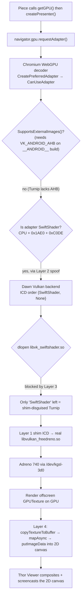

# How it works: WebGPU on the real Adreno GPU inside a Termux Chromium

This document explains, layer by layer, how WebGPU pieces end up running on the **real Adreno 740
GPU** inside a Termux-built Chromium that the user watches through the Thor Viewer — with **no
root and no rebuilt Chromium**. Every claim here is traceable to a test program, a captured log,
or a named function in Chromium/Dawn/Mesa source; where a mechanism is inferred rather than read
off, it is marked "observed".

## The environment

- **Device:** AYN Thor handheld — Android 13, Snapdragon 8 Gen 2, **Adreno 740**, arm64.
- **Stack:** Android → Termux (bionic userland, no root) → proot Ubuntu 26.04 (glibc, where Claude
  Code runs). Both userlands share one `PATH`.
- **GPU access is KGSL-only.** The GPU is reached through `/dev/kgsl-3d0`. `/dev/dri/renderD128`
  and `card0` exist but are the **display controller** (`msm_drm`/`mdss`), not a render node for
  the GPU — there is no DRM render node and no DRM master for the Adreno.
- **Only Termux's bionic Mesa Turnip reaches the GPU.** `pkg install mesa-vulkan-icd-freedreno`
  (Mesa 26.2.2) ships a Turnip build with the KGSL backend; `vulkaninfo --summary` reports
  "Turnip Adreno (TM) 740", Vulkan 1.4. Stock Ubuntu/glibc Turnip has only the DRM/msm backend
  (no `kgsl` strings) and enumerates zero GPUs here ("Failed to detect any valid GPUs"). So a
  glibc program — including the prebuilt glibc `dawn.node` from `npm i webgpu` — cannot reach this
  GPU at all. This is why the whole solution lives in Termux/bionic.
- **The browser:** Termux Chromium **149.0.7827.155**. It is a Linux/ozone build (headless/x11,
  not an Android build), but third-party code inside it — including Dawn — is compiled with
  `__ANDROID__` defined, so Dawn behaves as if it were on Android. This one detail drives Layer 2.
- **The viewer:** the Thor Viewer (`:4850`) mirrors Claude's Chromium over CDP screencast. WebGL2
  already runs hardware-accelerated in it via ANGLE-on-Vulkan (`--use-angle=vulkan`); that config
  is the shipped, known-good baseline and is not disturbed by any of this.

## The result, stated precisely

With the four layers below active (env `~/.config/thor-gpu/env`, wrapper `~/.local/bin/chromium-gpu`):

- `navigator.gpu.requestAdapter()` returns an adapter that **runs WGSL on the Adreno**.
- Measured in the isolated test session: a 4x4 render+readback smoke test returns the exact
  expected pixel (`255,0,128,255`); a 20x Mandelbrot at 1024x1024 completes in **76 ms**
  (~265 fps-equivalent) — a software rasterizer on this device is <5 fps-equivalent.
- Adapter reports `maxTextureDimension2D = 16384` and the `shader-f16` feature — hardware limits,
  not SwiftShader's.
- Canvas presentation through the readback path: **~140 fps in a raw render+readback loop at 768x432**, **60 fps fullscreen at
  1280x633**.
- Soak tests switching pieces (10 rounds WebGPU↔WebGPU, 8 rounds WebGL↔WebGPU): **0 GPU-process crashes**, no fallbacks, battery 38–39 °C throughout.

## Why it is four layers

Each layer fixes exactly one failure that blocks the previous one. Removing any one puts the
symptom back.

| # | Layer | Fixes |
|---|-------|-------|
| 1 | Pass-through ICD hiding `VK_KHR_display` | wgpu/Dawn enumerating the GPU at all |
| 2 | Same ICD, opt-in Dawn spoof (SwiftShader IDs) | Chromium's decoder *accepting* the adapter |
| 3 | `LD_PRELOAD` `dlopen` blocker for `libvk_swiftshader.so` | Dawn picking the crashy bundled SwiftShader |
| 4 | Offscreen render + readback + 2D blit (web app) | The disguised adapter being un-compositable |

---

## Layer 1 — hide `VK_KHR_display` so the GPU can be enumerated

**Symptom.** wgpu-native saw *no* GPU on this device even though `vulkaninfo` worked fine.

**Root cause (verified, `test/display-ext-repro.c`).** Turnip advertises `VK_KHR_display` and its
companions (`VK_KHR_get_display_properties2`, `VK_EXT_direct_mode_display`,
`VK_EXT_acquire_drm_display`, `VK_EXT_acquire_xlib_display`, `VK_EXT_display_surface_counter`)
unconditionally from `vkEnumerateInstanceExtensionProperties`. Display WSI needs a DRM master to
initialize; a KGSL-only device has none. Enabling **any** of those extensions when creating a
`VkInstance` then makes `vkEnumeratePhysicalDevices` return `VK_ERROR_INITIALIZATION_FAILED` (-3)
with count 0. The repro output:

```
surface+display:   enumerate=-3 count=0
+display_props2:   enumerate=-3 count=0
+direct_mode:      enumerate=-3 count=0
+acquire_drm:      enumerate=-3 count=0
full-wgpu-drm-set: enumerate=-3 count=0
```

An instance with none of them enabled enumerates the Adreno normally. Libraries such as
wgpu-native follow the common "enable every advertised extension" pattern, so they trip this and
the GPU silently disappears. (Upstream report drafted in `docs/mesa-issue-draft.md`.)

**Fix.** `turnip-kgsl-shim` is a real pass-through Vulkan ICD. The Termux Vulkan loader
(`libvulkan.so`, LunarG) `dlopen()`s it like any driver; it forwards every call to the real Turnip
ICD (`libvulkan_freedreno.so`) except `vkEnumerateInstanceExtensionProperties`, which it filters so
the hidden extensions are never advertised. A caller that "enables everything advertised" now
never requests the broken ones. See `src/shim.c` (`shim_EnumerateInstanceExtensionProperties`,
`is_hidden`) and the README for ICD internals.

**Install detail that matters.** The `.so` must live at `$PREFIX/lib/libvulkan_turnip_shim.so`
(Termux's lib dir), not under `$HOME`: bionic's linker only lets the loader `dlopen` a driver from
trusted paths. The manifest (`turnip_shim_icd.json`) is data and can live in `$HOME`. Selected via
`VK_ICD_FILENAMES` pointing at that manifest.

**Evidence it worked.** With the shim, the bionic `wgpu-native` v29 test (`test/wgpu-render.c`)
renders WGSL offscreen on Turnip and reads back correct pixels — prints `GPU-RENDER-OK`. This is
Layer 1 proven in isolation, no browser involved.

---

## Layer 2 — make Turnip look like SwiftShader so Chromium's decoder accepts it

**Symptom.** Even with Layer 1, the browser page's `requestAdapter()` returned the SwiftShader
(CPU) adapter, never Turnip — although `chrome://gpu`'s Dawn Info *did* enumerate
`<Integrated GPU> Vulkan backend - Turnip Adreno (TM) 740`.

**Root cause (from Chromium 149 source, `gpu/command_buffer/service/webgpu_decoder_impl.cc`).**
The decoder builds the page's adapter in `CreatePreferredAdapter` and gates candidates through
`CanUseAdapter`. On this build, `CanUseAdapter` accepts a native Vulkan adapter only if:

- `native_adapter.SupportsExternalImages()` is true, **or**
- the adapter looks exactly like SwiftShader: `deviceType == CPU`, `vendorID == 0x1AE0`,
  `deviceID == 0xC0DE` (for which Chromium uses a manual upload/readback path to present canvases).

Dawn's `SupportsExternalImages()` on an `__ANDROID__` build specifically requires
`VK_ANDROID_external_memory_android_hardware_buffer`. Termux's Turnip does not expose that
extension. (It exposes the desktop-Linux external-memory extensions — `VK_KHR_external_memory_fd`,
`VK_EXT_external_memory_dma_buf`, `VK_EXT_image_drm_format_modifier`, `VK_KHR_external_semaphore_fd`
— which a Linux-desktop Dawn build would have accepted, but the Android-flavored build does not
check for them.) So the real Turnip fails the external-images test, and the only adapter the
decoder will take is one that *is* SwiftShader.

**Fix.** The shim's opt-in mode `TURNIP_SHIM_SPOOF_CPU_FOR=Dawn`. It intercepts `vkCreateInstance`
and records which `VkInstance`s were created with `VkApplicationInfo.pEngineName == "Dawn"` (Dawn
sets this). For physical devices enumerated **from those instances only**,
`vkGetPhysicalDeviceProperties[2][KHR]` reports the real Turnip GPU but rewrites vendor/device IDs
to SwiftShader's (`0x1AE0`/`0xC0DE`) and `deviceType` to CPU (`spoof_props` in `src/shim.c`).
Every other caller — ANGLE, `vulkaninfo`, wgpu-native, anything not naming its engine "Dawn" —
sees the real, unmodified Turnip identity, so WebGL2 is untouched. Verify the selectivity with
`test/spoof-check.c` (engine `Dawn` reports vendor `0x1ae0` type `1`/CPU; engine `ANGLE` reports
the real IDs).

**Evidence.** With the spoof active, `chrome://gpu` reports "WebGPU interop: Hardware accelerated"
and the page is offered an adapter — but see Layer 3 for why that alone still crashed.

**Honest framing.** This is a genuine hack, not a clean fix. It depends on Dawn continuing to set
`pEngineName == "Dawn"` and on Chromium's decoder continuing to special-case exactly those
SwiftShader IDs — both implementation details that can change on a Chromium/Dawn upgrade.

---

## Layer 3 — stop Chromium loading its own SwiftShader, which crashes here

**Symptom.** With Layers 1+2, creating a WebGPU device **segfaulted the GPU process**. This was the
user's original "the WebGPU piece freezes" bug.

**Root cause (captured with `tools/segv-backtrace.c`).** Chromium's *bundled* SwiftShader
(`libvk_swiftshader.so`) is also registered as a Vulkan ICD, and Dawn's Vulkan backend probes the
SwiftShader ICD **before** the system loader — `BackendVk.cpp` orders ICDs as
`{ICD::SwiftShader, ICD::None}`. With both the bundled SwiftShader and the spoofed Turnip looking
like "SwiftShader", Dawn picks the bundled one and it crashes on device creation. The backtrace
helper (an `LD_PRELOAD` library that interposes `sigaction`, keeps its own SIGSEGV handler first,
and frame-walks with `dladdr()` since there is no `ptrace`/`gdb` in proot) pinned the fault to
`libvk_swiftshader.so+0xc03aec`, fault address `0x14`, inside SwiftShader's device/adapter creation
path — not Turnip, Dawn, or the shim. See `docs/segv-backtrace.md`.

**Fix.** `tools/no-dlopen.c` builds `libno-dlopen.so`, a tiny bionic `LD_PRELOAD` library that
makes `dlopen()` fail for any path containing a substring in `NO_DLOPEN_MATCH` (here
`libvk_swiftshader`) and makes the following `dlerror()` return a real message (Dawn's
`DynamicLib` builds a `std::string` from it; a NULL there would itself crash). With the bundled
SwiftShader unloadable, the spoofed Turnip is the only "SwiftShader" Dawn can find. See
`docs/no-dlopen.md`.

**Scoping detail that matters.** The preload must reach the bionic `chrome` binary **only**. The
normal `chromium-browser` launcher is a shell script that calls glibc helper tools along the way;
injecting a bionic `.so` into those would break them (bionic vs glibc are not interchangeable). So
when `THOR_PRELOAD` is set, the wrapper `exec`s the real binary directly:

```sh
env LD_PRELOAD=$THOR_PRELOAD $PREFIX/lib/chromium/chrome --extra-plugin-dir=...
```

rather than exporting `LD_PRELOAD` into the wrapper's own shell.

**Evidence.** With Layers 1+2+3, the isolated session reports adapter "Turnip Adreno (TM) 740"
(maxTex 16384, shader-f16), the smoke pixel is exact, the 20x Mandelbrot runs in 76 ms, WebGL is
still hardware, and there are **0 GPU crashes**.

---

## Layer 4 — present the frame the disguised adapter cannot composite

**Symptom.** The adapter now works for compute/offscreen rendering, but a `webgpu`-context canvas
renders **blank** in the viewer — because Chromium cannot composite a WebGPU canvas from an adapter
it believes is SwiftShader on this device.

**Fix (in the web app, `public/gpu.js` `createPresenter`).** Pieces do not draw to a `webgpu`
context. Instead they:

1. render on the GPU into an **offscreen** `GPUTexture` (usage
   `RENDER_ATTACHMENT | COPY_SRC | TEXTURE_BINDING`),
2. `copyTextureToBuffer` into a `MAP_READ` buffer (row pitch aligned to 256 bytes),
3. `mapAsync` + read the pixels back, and
4. `putImageData` them into a normal `2d` canvas — which composites and screenshots fine.

`createPresenter` owns `stage.canvas` as a 2D canvas and exposes `begin()` (fresh encoder +
render-target view) and `present()` (submit → readback → blit). The same code path also works on
real Chrome with a native adapter.

Because the adapter's reported name cannot be trusted (it says "swiftshader" by design),
`getGPU()` verifies the GPU is real by **timing** a probe (a 512x512 Mandelbrot x10): a real GPU
finishes in a few ms, a CPU rasterizer takes seconds; if the probe exceeds 400 ms it throws and
the piece falls back to an "open in real Chrome" card rather than freezing the device.

**Measured cost.** Readback presentation runs ~140 fps in a raw render+readback loop at 768x432 and 60 fps fullscreen at
1280x633 — comfortably above the viewer's frame budget. The readback is the price of not having
compositor interop; it scales with resolution.

---

## Request → adapter → present flow



## What each layer's absence looks like (failure modes)

- **No Layer 1:** wgpu/Dawn enumerate zero GPUs (`vkEnumeratePhysicalDevices` = -3). Page gets no
  hardware adapter path at all.
- **No Layer 2:** `CanUseAdapter` rejects Turnip (no external-image support on the `__ANDROID__`
  build); page gets the SwiftShader adapter only.
- **No Layer 3:** Dawn loads and picks the bundled `libvk_swiftshader.so`; GPU process segfaults
  at `+0xc03aec` on device creation (the original freeze).
- **No Layer 4:** WebGPU compute/offscreen works but the on-screen `webgpu` canvas is blank in the
  viewer.

## Cross-references

- Shim source and ICD internals: `../README.md`, `src/shim.c`
- Turnip/KGSL bug + upstream draft: `mesa-issue-draft.md`, `test/display-ext-repro.c`
- Crash diagnosis: `segv-backtrace.md`, `tools/segv-backtrace.c`
- dlopen blocker: `no-dlopen.md`, `tools/no-dlopen.c`
- Web-app presenter contract: `canvas-lab/public/gpu.js`, `canvas-lab/pieces/webgpu-gradient/`
- Reproduce end to end: `REPRODUCE.md`
